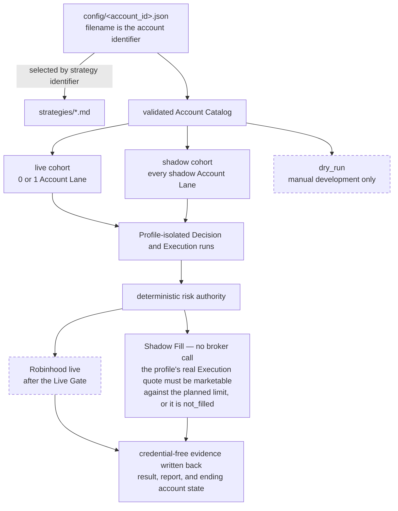

# Ripple Trading — Proposal

**Current stage:** Ripple has a validated account catalog, dry-run and shadow paths, hosted `next_session_open` acceptance, a reviewed Robinhood broker-write loop, and a configured `same_session_close` shadow cohort whose acceptance review remains tracked in `docs/TODO.md`. The remaining work includes close-profile hosted acceptance, comparable cycles, after-cost metrics, and reliability review before a second live lane or more capital.

`docs/ARCHITECTURE.md` is the current technical design, `docs/DECISIONS.md` records durable choices, and `docs/TODO.md` tracks unfinished work.

## What Ripple is for

Ripple makes AI-authored trading decisions reviewable: save the inputs, freeze a proposed plan, check it against fresh facts, and record the result. Each strategy runs with its own configuration and portfolio history while sharing the same deterministic risk checks. It has two connected goals:

1. learn which responsibilities belong to an LLM, deterministic code, the hosting platform, and the human owner; and
2. collect comparable live and shadow evidence so the owner can review records, replay behavior later, and decide whether a strategy deserves further evaluation.

Ripple does not claim that an AI can beat the market. A shadow result is an explicit fill assumption, and live trading remains financially consequential and human-owned.

## How strategies stay separate

Each account configuration contains a human-readable description, one Strategy Spec identifier, an execution mode, a symbol universe, and risk limits. Adding a Strategy Spec means adding a version-named Markdown file and selecting it from an account configuration; catalog validation fails when that file does not exist or more than one configuration is live.

Current lane membership and account-to-strategy bindings live exclusively in `config/*.json`. The validated catalog and `list-accounts` command expose those deployment facts without duplicating them here. Strategy attribution and lane isolation keep each lane's evidence distinct; no result automatically promotes a strategy or changes capital.

Canonical lowercase identifiers own state under `state/accounts/<account_id>/trading_days/<trade_date>`. The trade date is the frozen Execution-session date, so a profile-attributed Decision and its Execution evidence stay together.

## Mode contract

- `live`: selected by the live Decision and Execution schedules; at most one configuration may use it. Real orders remain blocked until the reviewed Agentic Robinhood loop, broker binding proof, hosted acceptance, and explicit owner approval are complete.
- `shadow`: selected with every other shadow lane in its mode-and-profile scheduled cohort. Deterministic checks run normally. A marketable allowed order is assumed filled at the documented Execution quote with zero fees and zero slippage, then written as credential-free evidence and ending virtual account state.
- `dry_run`: excluded from all schedules. It exists for deliberate manual fixture and strategy development and never calls the broker or writes shadow-fill evidence.

Changing a shadow lane to live is not an automatic promotion. The owner must reconcile the real broker account, positions, cash baseline, connection, and Live Gate. The system never opens or funds an account, enables live mode, increases capital, or clears a tier-two lock.

## Evidence and release gates

| Stage | Evidence required | What it permits |
|---|---|---|
| Repository acceptance | Catalog validation, isolated dry/shadow fixture cycles, and all core tests pass | Configure hosted cohorts |
| Shadow hosted acceptance | One scheduled, profile-attributed Decision and Execution cycle is reviewable | Begin accumulating comparison evidence for that profile |
| Live hosted acceptance | Intended live lane completes the required scheduled no-write acceptance and account binding proof | Review the lane for Live Gate approval |
| Small live canary | Reviewed broker-write loop plus explicit owner approval | Begin with the approved $500–1000 allocation |
| Strategy or capital change | Reviewed live/shadow evidence and a new human decision | Consider a specific switch or increase; never automatic |

## Boundaries

The current release is long-only and supports `next_session_open` plus a configured `same_session_close` shadow cohort awaiting hosted acceptance. It does not include a live same-session lane, same-day entry and exit, a dashboard, automated strategy ranking or promotion, multiple simultaneous live accounts, transactional submission state, exactly-once broker execution, automatic reconciliation, sophisticated slippage/fee models, a Python strategy plugin engine, or historical backtesting.

Ripple evaluates strategies through forward shadow runs: the agent makes a decision using facts available at the time, and the later result records an assumed fill. Live and shadow paths share risk checks, but their account sources and execution effects differ; timing follows each lane's profile. The repository has no historical market-data replay system or backtester. Replaying a recorded plan can test deterministic behavior, but cannot recreate the original model judgment. Comparable strategy evidence must still accumulate cycle by cycle.

Live trading and its consequences remain the account owner's responsibility. Read `docs/ARCHITECTURE.md` for the system walkthrough and `docs/INVARIANTS.md` for the safety contract.
