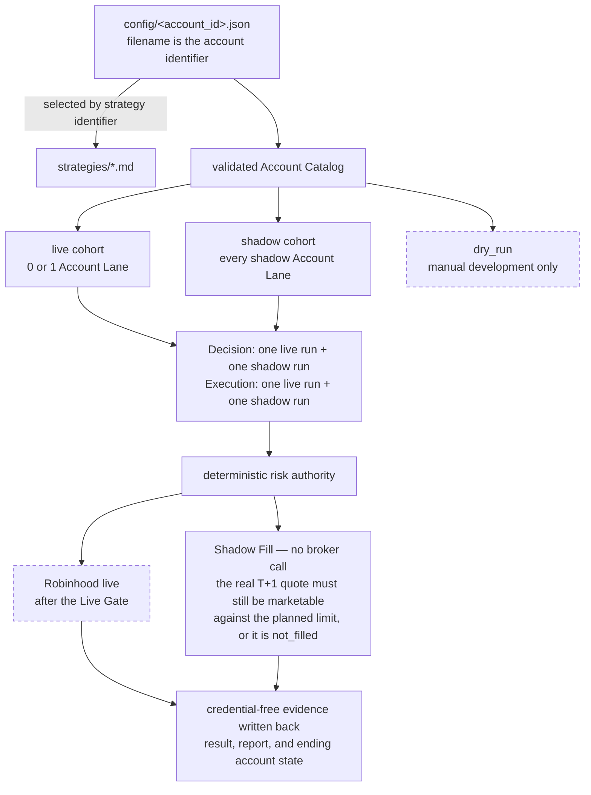

# Ripple Trading — Proposal

**Current stage:** Ripple has a validated account catalog plus fixture-backed dry-run and shadow paths. The scheduled live/shadow routine topology is specified; hosted acceptance and the reviewed Robinhood broker-write loop remain unfinished.

`docs/ARCHITECTURE.md` is the current technical design, `docs/DECISIONS.md` records durable choices, and `docs/TODO.md` tracks unfinished work.

## What Ripple is for

Ripple is a small system for learning how multiple investment strategies behave when each LLM-authored decision passes through the same deterministic, inspectable safety checks. It has two connected goals:

1. learn which responsibilities belong to an LLM, deterministic code, the hosting platform, and the human owner; and
2. collect comparable live and shadow evidence so the owner can review records, replay behavior later, and decide whether a strategy deserves further evaluation.

Ripple does not claim that an AI can beat the market. A shadow result is an explicit fill assumption, and live trading remains financially consequential and human-owned.

## Target structure now represented in the repository

Each account configuration contains a human-readable description, one Strategy Spec identifier, an execution mode, a symbol universe, and risk limits. Adding a Strategy Spec means adding a version-named Markdown file and selecting it from an account configuration; catalog validation fails when that file does not exist or more than one configuration is live.

Current lane membership and account-to-strategy bindings live exclusively in `config/*.json`. The validated catalog and `list-accounts` command expose those deployment facts without duplicating them here. Strategy attribution and lane isolation keep each lane's evidence distinct; no result automatically promotes a strategy or changes capital.

Canonical lowercase identifiers own state under `state/accounts/<account_id>/trading_days/<trade_date>`. The trade date is the intended next-weekday Execution date, so a prior-evening Decision and its Execution evidence stay together.

## Mode contract

- `live`: selected by the live Decision and Execution schedules; at most one configuration may use it. Real orders remain blocked until the reviewed Agentic Robinhood loop, broker binding proof, hosted acceptance, and explicit owner approval are complete.
- `shadow`: selected with every other shadow lane in the shadow schedules. Deterministic checks run normally. A marketable allowed order is assumed filled at the documented next-weekday quote with zero fees and zero slippage, then written as credential-free evidence and ending virtual account state.
- `dry_run`: excluded from all schedules. It exists for deliberate manual fixture and strategy development and never calls the broker or writes shadow-fill evidence.

Changing a shadow lane to live is not an automatic promotion. The owner must reconcile the real broker account, positions, cash baseline, connection, and Live Gate. The system never opens or funds an account, enables live mode, increases capital, or clears a tier-two lock.

## Evidence and release gates

| Stage | Evidence required | What it permits |
|---|---|---|
| Repository acceptance | Catalog validation, isolated dry/shadow fixture cycles, and all core tests pass | Configure hosted cohorts |
| Shadow hosted acceptance | One scheduled prior-evening Decision and next-weekday Shadow Execution is reviewable | Begin accumulating comparison evidence |
| Live hosted acceptance | Intended live lane completes the required scheduled no-write acceptance and account binding proof | Review the lane for Live Gate approval |
| Small live canary | Reviewed broker-write loop plus explicit owner approval | Begin with the approved $500–1000 allocation |
| Strategy or capital change | Reviewed live/shadow evidence and a new human decision | Consider a specific switch or increase; never automatic |

## Boundaries

The current release is long-only, prior-evening Decision and next-weekday Execution. It does not include a dashboard, automated strategy ranking or promotion, intraday trading, multiple simultaneous live accounts, transactional submission state, exactly-once broker execution, automatic reconciliation, sophisticated slippage/fee models, or a Python strategy plugin engine.

Live trading and its consequences remain the account owner's responsibility. Read `docs/ARCHITECTURE.md` for the system walkthrough and `docs/INVARIANTS.md` for the safety contract.
