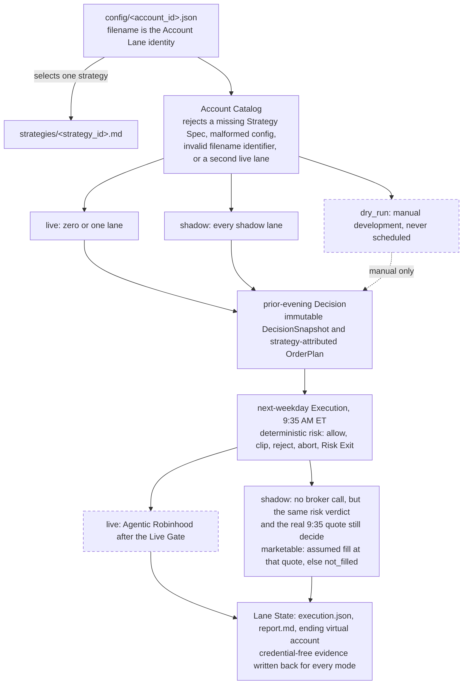

# Ripple Trading

Ripple is a small, inspectable experiment in AI-native development and agentic trading. Multiple isolated Account Lanes can select different checked-in investment strategies while sharing deterministic validation and risk rules. The goal is to monitor live and shadow records, understand failures, and build evidence for later human review—not to promise returns.

The repository now implements a validated account catalog, a manual dry-run path, and a T+1 quote-based shadow execution path. Hosted schedules and the reviewed live Agentic Robinhood broker-write loop remain unfinished.

## Requirements and verification

Ripple needs CPython 3.12 or later and nothing else: the deterministic core, the CLI, and the whole test suite use only the standard library. Operators drive it with [`uv`](https://docs.astral.sh/uv/), which reads `.python-version` and selects that interpreter for you.

```bash
uv run --no-cache python -m unittest discover -s tests -t .
uv run --no-cache python -m ripple.mvp validate-configs
```

The first command runs the whole test suite; the second validates every account configuration and its selected Strategy Spec. Without `uv`, run the same commands with any Python 3.12 interpreter from the repository root. A system Python older than 3.12 fails on import, which is a version problem rather than a missing package.

## Run one cycle offline

No model, no API key, no broker connection, no network. This replays a checked-in fixture through the real publisher, the real deterministic risk module, and the real shadow adapter:

```bash
uv run --no-cache python -m ripple.mvp run-shadow-cycle \
  --config config/examples/demo_lane.json \
  --fixture fixtures/mvp/demo_lane_cycle.json \
  --output /tmp/ripple-demo/demo_lane
```

It writes a complete Decision Cycle — `decision_snapshot.json`, `order_plan.json`, `execution.json`, and a readable `report.md` — to `/tmp/ripple-demo/demo_lane/trading_days/2026-08-25/`. The report ends with `No broker write tool was called.` The demo lane lives outside the `config/*.json` glob, so it is invisible to the catalog and can never be selected by a scheduled run. See [`docs/RUNNING.md`](docs/RUNNING.md) to turn it into a lane of your own.

## Actual structure



Daily hosting uses four schedule triggers: one live Decision run, one all-shadow Decision run, one live Execution run, and one all-shadow Execution run. A live run may have no selected account; dry-run configurations are never scheduled.

Each account configuration contains:

- a narrative `description` of its purpose, strategy, universe, and risk constraints;
- a `strategy` identifier that must resolve to `strategies/<strategy>.md`;
- `execution.mode` in `live`, `shadow`, or `dry_run`;
- its allowed symbol universe and deterministic risk values; and
- `shadow.initial_cash` when it owns a virtual portfolio.

Catalog validation rejects a missing Strategy Spec, malformed config, invalid filename identifier, or more than one live lane.

## Decision and execution

The Decision Routine gathers allowed facts, follows only the selected Strategy Spec, and publishes an immutable `DecisionSnapshot` and `OrderPlan`. The plan freezes both `account_id` and `strategy_id`. Decision has no order-review, place, cancel, or modification authority.

The separate Execution Routine gathers current account facts and quotes and runs deterministic risk code. It can allow, scale down, reject, or abort planned actions; it cannot form a new thesis. A deterministic full-position stop-loss/take-profit Risk Exit is the only unplanned-order exception.

For shadow execution, a risk-allowed BUY limit is marketable when the next-weekday quote is at or below the limit; a SELL limit is marketable when the quote is at or above it. A marketable action is assumed filled at that quote with zero fees and zero slippage. The result records fill attempts and ending virtual account state. These are explicit assumptions, not broker fills.

### Why Decision is prior-evening and Execution is at 9:35 AM

The evening Decision uses completed daily bars and leaves time to gather source evidence before freezing the plan. Execution at 9:35 AM observes the actual regular-session open and a fresh quote while limits anchored to the prior close are still relevant. This fits both the slower [Growth Momentum](strategies/growth_momentum_v3.md) signal and the more time-sensitive [Earnings Drift](strategies/earnings_drift_v1.md) event window. Waiting until noon or 3:00 PM makes the frozen price anchor progressively stale and can favor intraday reversals over the strongest continuations; planning at 3:00 PM would instead use an incomplete session and collapse the Decision/Execution boundary. This is structural rationale, not proof that 9:35 produces better returns.

## Safety model

Deterministic Python controls schemas, account binding, timing, quote freshness, baseline matching, sizing, cash reservation, position caps, loss and drawdown breakers, wash-sale checks, and Risk Exits. Routine prompts control LLM research and tool use. The human owner controls schedules, Robinhood binding, funding, live activation, capital, and restart.

Core limits are 20% per symbol, three new positions per day, 5% daily loss, 10%/15% drawdown tiers, 15-minute quote age, 30-day taxpayer-wide wash-sale lookback, 8% stop loss, and 20% take profit. Missing or inconsistent required data fails closed.

The catalog permits at most one live configuration, but this is not a broker-side security boundary. Live v1 still lacks exactly-once execution and automatic ambiguous-outcome reconciliation. See [`docs/INVARIANTS.md`](docs/INVARIANTS.md) for the full contract.

## Running Ripple

Ripple separates **what a run must do** from **who runs it**. The four prompts in
[`routines/`](routines/) are the durable contract — one per cohort phase — and the Agent Runner
that executes them is replaceable: Codex scheduled tasks drive the current deployment, but nothing
in the Python privileges one product over another.

[`docs/RUNNING.md`](docs/RUNNING.md) has the offline demo, the seven requirements any runner must
satisfy, the prompt library for normal, manual, and historical-backfill runs, and setup for the
runners known to satisfy the contract. [`routines/SCHEDULE.md`](routines/SCHEDULE.md) is the
operator-owned schedule manifest, and [`docs/RUNBOOK.md`](docs/RUNBOOK.md) covers operations,
incidents, and the kill switch.

## Repository map

| Path | Purpose |
|---|---|
| [`config/`](config/) | One filename-identified configuration per Account Lane; [`config/examples/`](config/examples/) holds unscheduled samples |
| [`strategies/`](strategies/) | Version-named Strategy Specs selected by config |
| [`ripple/`](ripple/) | Catalog, artifacts, CLI, deterministic risk, and shadow simulation |
| [`routines/`](routines/) | Live/shadow Decision and Execution contracts plus schedules |
| [`fixtures/`](fixtures/) | Credential-free dry and shadow evidence inputs |
| [`tests/`](tests/) | Catalog, isolation, artifact, risk, timing, and fill coverage |
| [`docs/`](docs/) | Architecture, decisions, invariants, operations, and unfinished work; [`RUNNING.md`](docs/RUNNING.md) covers runners |

Canonical state uses lowercase config identifiers and groups each prior-evening Decision and next-weekday Execution under `state/accounts/<account_id>/trading_days/<trade-date>`.

## Current gates

Before any lane becomes live, Ripple still needs the reviewed Robinhood read/review/place/cancel loop, intended-account binding proof, scheduled hosted acceptance, real cash/position reconciliation, and explicit owner approval. A strategy switch or capital increase remains a separate human decision.

Read [`PROPOSAL.md`](PROPOSAL.md), [`docs/ARCHITECTURE.md`](docs/ARCHITECTURE.md), [`docs/TODO.md`](docs/TODO.md), and [`docs/RUNBOOK.md`](docs/RUNBOOK.md) for the complete current model.

Ripple is educational software, not financial advice. Live trading and its consequences remain the account owner's responsibility.
