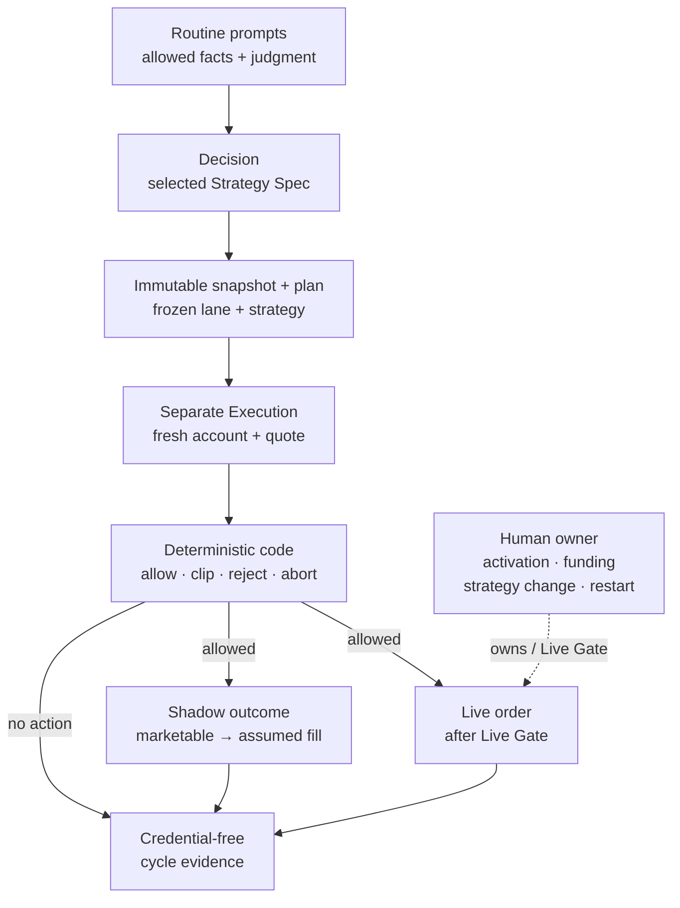

# Ripple Trading

**An AI agent proposes a trade. Python checks whether it can proceed. A separate run records what happened.**

Ripple explores how to turn AI investment judgment into decisions you can inspect and test. Each
strategy runs in its own **Account Lane**: a configuration, portfolio and history kept separate from
other lanes. All lanes share deterministic risk checks. A **Strategy Spec** is the versioned Markdown
policy the agent reads to make a decision.

The engineering question is: **how do you give an agent useful judgment while keeping money,
timing and execution constraints explicit?** The useful output is a record of what the agent knew,
what it proposed, what the checks allowed and what actually happened—or was assumed in simulation.

Ripple is a working MVP with an offline demo, scheduled shadow runs and a reviewed small live
broker loop. Profile-specific acceptance and reliability review remain tracked in
[unfinished work](docs/TODO.md). It does not establish profitability or production-grade execution
reliability.

[System overview](#who-decides-validates-and-authorizes) · [Real repair case](#ai-native-development-a-real-repair) · [Run the demo](#run-one-cycle-offline) · [Design choices](#design-choices-you-can-inspect)

## What makes this AI-native?

There are two parts, with different evidence:

| Part | How it works | Where to inspect it |
|---|---|---|
| AI in the product | An agent gathers sources and applies a Markdown investment policy; Python validates its output and calculates risk | [Routine contracts](routines/), [strategy example](strategies/growth_momentum_v1.md), [risk code](ripple/risk.py) |
| AI in development | The owner sets the required behavior and scope; an agent investigates and implements a bounded change with test evidence | [Trade-date repair](#ai-native-development-a-real-repair), including the recorded human and agent contributions |

The Python package itself does **not** call an LLM or a broker. A hosted agent runs the routine,
uses its available research or broker tools, and invokes the Python core. The offline demo supplies
a fixed decision so anyone can inspect the deterministic part without an AI account.

## Who decides, validates, and authorizes



Read the diagram from top to bottom: research becomes a frozen plan, then a fresh Execution
session checks it against current facts. An allowed action can produce a shadow fill or a live
order; a rejected action still produces evidence. “Immutable” means the publisher refuses to
overwrite an existing cycle's artifacts; Git itself is not a tamper-proof store.

Decision has no authority to review, place, cancel or modify orders. Execution forms no new
investment thesis. The owner controls activation, funding, strategy changes and restart; the
**Live Gate** is the set of prerequisites for authorized real orders. Prompt-defined tool boundaries
are part of the operating contract, not a code-level broker-capability firewall. See
[Architecture](docs/ARCHITECTURE.md) for the full boundary and live execution details.

## AI-native development: a real repair

A scheduled run rejected an authorized same-day plan. The owner questioned that result and
requested a fix; the agent found that Execution recomputed the next trading day instead of
reading the date already frozen in the plan.


**What the test was missing:** it checked that Decision could publish the plan, but stopped before
Execution consumed it. Extending that existing test exposed the broken handoff; the total stayed
at 93 tests. The regression directly exercises the dry-run path, and the shadow caller uses the
same repaired timing validator. This verifies software behavior, not a broker fill.

[Inspect the fix](https://github.com/Alicia1529/ripple-trading/commit/68fccb2f843f4ebee07cd8b4f9afe353f9cc5da0)
· [Reproduce the failure and repair](learning/frozen-trade-date-case-study.md#4-the-evidence-test-the-next-stage-not-just-publication)
· [Read the full case and interview explanation](learning/frozen-trade-date-case-study.md)
· [Scope workflow](learning/compile-scope-before-codex-execution.md)

## Run one cycle offline

From the repository root, with Python 3.12+ and `uv` available, run this checked-in fixture through the publisher, risk module and shadow adapter. The cycle makes no model, market-data or broker calls:

```bash
uv run --no-cache python -m ripple.mvp run-shadow-cycle \
  --config config/examples/demo_lane.json \
  --fixture fixtures/mvp/demo_lane_cycle.json \
  --output /tmp/ripple-demo/demo_lane
```

It writes a complete Decision Cycle — `decision_snapshot.json`, `order_plan.json`, `execution.json`, and a readable `report.md` — to `/tmp/ripple-demo/demo_lane/trading_days/2026-08-25/`. The report ends with `No broker write tool was called.` The example config sits outside `config/*.json`, so scheduled runs do not select it. Use a fresh output directory for each replay: publication refuses to overwrite existing evidence.

### One decision, from intent to evidence

Follow one reproducible offline fixture through the hosted system's responsibility boundaries.
Each step identifies its owner and whether its authority comes from a prompt contract, code checks,
or human authorization.


**Read the evidence:** the snapshot records what Decision was allowed to know; the plan records
what it intended; execution records what risk allowed and Shadow assumed; the report makes the
result readable. All four files belong to one Account Lane, Strategy Spec and trade date.

This example supplies the Decision rather than calling an LLM. Its timestamps are modeled and its
fill assumes zero fees and slippage. The hosted runner starts separate Decision and Execution
sessions; the offline command above processes both stages without waiting overnight. See
[Anatomy of one Decision Cycle](docs/ANATOMY_OF_A_CYCLE.md) for a text walkthrough and field-level
evidence, or [Architecture](docs/ARCHITECTURE.md) for the full live/shadow topology.

## Design choices you can inspect

These are useful starting points for a technical discussion: each choice solves a specific problem
and leaves a visible limitation.

| Problem | Design choice | Evidence and tradeoff |
|---|---|---|
| A later run could reinterpret the original decision | Freeze the inputs, plan, strategy and trade date before Execution | [Publisher](ripple/mvp.py) and [handoff regression](learning/frozen-trade-date-case-study.md). Replaying a supplied plan tests execution behavior; it does not reproduce the model's judgment |
| A model may calculate a financial quantity inconsistently | Use Decimal arithmetic and shared Python risk rules; selected strategies also require compiled numeric facts | [Risk tests](tests/test_risk.py) and [facts compiler](ripple/growth_momentum_lite.py). Source gathering and qualitative judgment still depend on the agent |
| One strategy's state could contaminate another's result | Bind artifacts and execution to one lane and strategy | [Catalog](ripple/account_config.py) and [cycle tests](tests/test_mvp_cycle.py). Logical isolation does not create separate broker permissions |
| Simulation can make results look more executable than they are | Record fill assumptions and ending virtual state explicitly | [Shadow adapter](ripple/shadow.py) and [fill tests](tests/test_shadow_execution.py). Quote-based fills assume zero fees and slippage |
| A simple handoff can hide execution failures | Store cycle artifacts in Git and stop on ambiguous broker outcomes | [Reliability boundaries](docs/ARCHITECTURE.md#authority-and-reliability). Git provides continuity, not exactly-once order submission |

## Modes and timing

| Mode | What you get | Scheduled? |
|---|---|---|
| `dry_run` | Validated decision and proposed actions; no fills or broker calls | No |
| `shadow` | Risk-checked, quote-based assumed fills and a virtual portfolio | Yes, by timing profile |
| `live` | Risk-allowed orders through the reviewed broker loop, after the Live Gate | Yes; at most one live lane |

A **Cycle Profile** defines when Decision and Execution happen. `next_session_open` normally
plans in the evening and checks fresh quotes the next trading morning. `same_session_close`
plans and executes later on the same regular session and is currently used only for shadow work.
The plan freezes the intended trade date. The [schedule manifest](routines/SCHEDULE.md) owns the
six triggers and their windows; [config files](config/) own current lane membership and limits.

## Safeguards and evidence limits

Python checks account and plan matching, timing, fresh quotes, sizing, available cash, position
limits, loss/drawdown thresholds and loss-sale history. Missing or inconsistent required facts
authorize no planned order. A deterministic full-position stop-loss/take-profit **Risk Exit** is
the only unplanned-order exception. The [13 invariants](docs/INVARIANTS.md) define the contract.

Live execution has material limits: a risk-allowed fractional order becomes a regular-hours market
order only after its current quote satisfies the planned limit, but the eventual fill can still slip
beyond that price. Stable IDs and duplicate checks do not provide exactly-once execution. Ambiguous
broker outcomes stop for inspection. [Architecture](docs/ARCHITECTURE.md#execution) explains these
tradeoffs, including the frozen cash budget and standing owner authorization.

Passing tests demonstrates the behavior of the checked-in software against supplied inputs.
It does not establish source truth, faithful LLM policy execution, future broker fills or investment
returns. Strategy comparison, capital changes and restart after a severe drawdown remain human
review decisions; see [release gates](docs/TODO.md).

## Requirements and verification

Ripple needs CPython 3.12 or later: the deterministic core, the CLI, and the whole test suite use only the standard library. Operators drive it with [`uv`](https://docs.astral.sh/uv/), which reads `.python-version` and selects that interpreter for you.

```bash
uv run --no-cache python -m unittest discover -s tests -t .
uv run --no-cache python -m ripple.mvp validate-configs
```

The first command runs the whole test suite; the second validates every account configuration and its selected Strategy Spec. Without `uv`, run the same commands with any Python 3.12 interpreter from the repository root. If imports fail, check the interpreter version and that you are running from the repository root before installing packages.

## Where to go next

| If you want to… | Read |
|---|---|
| Understand the output without learning the whole codebase | [Anatomy of one cycle](docs/ANATOMY_OF_A_CYCLE.md), a reproducible fixture walkthrough |
| Discuss the architecture and its tradeoffs | [Architecture](docs/ARCHITECTURE.md) → [decisions and rationale](docs/DECISIONS.md) |
| Examine how the owner directed AI development | [Real repair case](learning/frozen-trade-date-case-study.md) → [scope workflow](learning/compile-scope-before-codex-execution.md) |
| Try a change locally | [Contributing](CONTRIBUTING.md) → [writing a strategy](docs/WRITING_A_STRATEGY.md) |
| Operate the hosted system | [Runner requirements](docs/RUNNING.md) → [runbook](docs/RUNBOOK.md) → [security](SECURITY.md) |

The [documentation map](docs/README.md) lists the remaining references, including the
[glossary](CONTEXT.md) and [product scope](PROPOSAL.md).

## Repository map

| Path | Purpose |
|---|---|
| [`config/`](config/) | One filename-identified configuration per Account Lane; [`config/examples/`](config/examples/) holds unscheduled samples |
| [`strategies/`](strategies/) | Version-named Strategy Specs selected by config |
| [`ripple/`](ripple/) | Catalog, artifacts, CLI, trading calendar, deterministic risk, and shadow simulation |
| [`routines/`](routines/) | Live/shadow Decision and Execution contracts plus schedules |
| [`fixtures/`](fixtures/) | Credential-free dry and shadow evidence inputs |
| [`tests/`](tests/) | Catalog, isolation, artifact, risk, timing, calendar, and fill coverage |
| [`docs/`](docs/) | Architecture, invariants, decisions, operations, and unfinished work — see [`docs/README.md`](docs/README.md) |

Each cycle's inputs, plan and outcome live together under
`state/accounts/<account_id>/trading_days/<trade-date>`. The directory is named for the frozen
Execution date, including the authorized pre-open exception described in the repair case.

Ripple is educational software, not financial advice. Trading involves risk of loss, and live trading and its consequences remain the account owner's responsibility.
