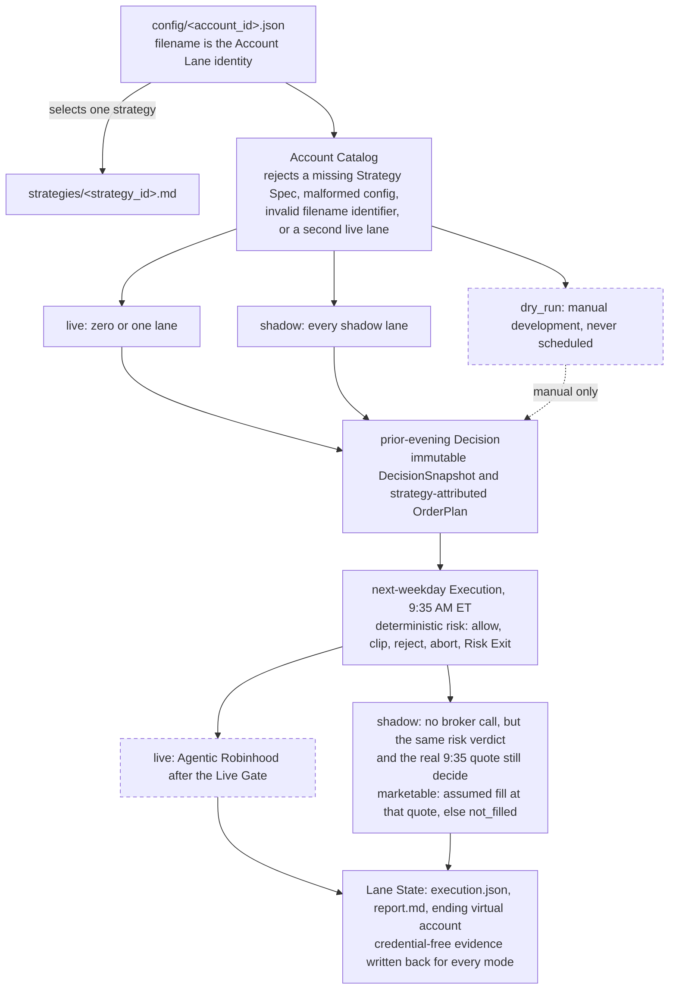

# Ripple Trading

Ripple is a small, inspectable experiment in AI-native development and agentic trading. Multiple isolated Account Lanes can select different checked-in investment strategies while sharing deterministic validation and risk rules. The goal is to monitor live and shadow records, understand failures, and build evidence for later human review—not to promise returns.

The repository now implements a validated account catalog, a manual dry-run path, and a T+1 quote-based shadow execution path. Hosted schedules and the reviewed live Agentic Robinhood broker-write loop remain unfinished.

## Actual structure



Daily hosting uses four schedule triggers: one live Decision run, one all-shadow Decision run, one live Execution run, and one all-shadow Execution run. A live run may have no selected account; dry-run configurations are never scheduled.

Each account configuration contains:

- a narrative `description` of its purpose, strategy, universe, and risk constraints;
- a `strategy` identifier that must resolve to `strategies/<strategy>.md`;
- `execution.mode` in `live`, `shadow`, or `dry_run`;
- its allowed symbol universe and deterministic risk values; and
- `shadow.initial_cash` when it owns a virtual portfolio.

Catalog validation rejects a missing Strategy Spec, malformed config, invalid filename identifier, or more than one live lane.

## Decision and execution

The Decision Routine gathers allowed facts, follows only the selected Strategy Spec, and publishes an immutable `DecisionSnapshot` and `OrderPlan`. The plan freezes both `account_id` and `strategy_id`. Decision has no order-review, place, cancel, or modification authority.

The separate Execution Routine gathers current account facts and quotes and runs deterministic risk code. It can allow, scale down, reject, or abort planned actions; it cannot form a new thesis. A deterministic full-position stop-loss/take-profit Risk Exit is the only unplanned-order exception.

For shadow execution, a risk-allowed BUY limit is marketable when the next-weekday quote is at or below the limit; a SELL limit is marketable when the quote is at or above it. A marketable action is assumed filled at that quote with zero fees and zero slippage. The result records fill attempts and ending virtual account state. These are explicit assumptions, not broker fills.

### Why Decision is prior-evening and Execution is at 9:35 AM

The evening Decision uses completed daily bars and leaves time to gather source evidence before freezing the plan. Execution at 9:35 AM observes the actual regular-session open and a fresh quote while limits anchored to the prior close are still relevant. This fits both the slower [Growth Momentum](strategies/growth_momentum_v3.md) signal and the more time-sensitive [Earnings Drift](strategies/earnings_drift_v1.md) event window. Waiting until noon or 3:00 PM makes the frozen price anchor progressively stale and can favor intraday reversals over the strongest continuations; planning at 3:00 PM would instead use an incomplete session and collapse the Decision/Execution boundary. This is structural rationale, not proof that 9:35 produces better returns.

## Safety model

Deterministic Python controls schemas, account binding, timing, quote freshness, baseline matching, sizing, cash reservation, position caps, loss and drawdown breakers, wash-sale checks, and Risk Exits. Routine prompts control LLM research and tool use. The human owner controls schedules, Robinhood binding, funding, live activation, capital, and restart.

Core limits are 20% per symbol, three new positions per day, 5% daily loss, 10%/15% drawdown tiers, 15-minute quote age, 30-day taxpayer-wide wash-sale lookback, 8% stop loss, and 20% take profit. Missing or inconsistent required data fails closed.

The catalog permits at most one live configuration, but this is not a broker-side security boundary. Live v1 still lacks exactly-once execution and automatic ambiguous-outcome reconciliation. See [`docs/INVARIANTS.md`](docs/INVARIANTS.md) for the full contract.

## Run Ripple with Codex prompts

Use a separate Codex task for Decision and Execution so the two phases remain isolated. Replace the bracketed values before sending a prompt.

### Normal run

Send the Decision prompt during the normal Decision window:

```text
Run Ripple's normal [live|shadow] Decision now. Read AGENTS.md and routines/DECISION_[LIVE|SHADOW].md completely and follow them exactly. Use the current validated cohort and selected Strategy Spec. This is a normal scheduled-style run, not manual and not a backfill. Stop after publishing and verifying the Decision artifacts; do not perform Execution.
```

On the next weekday, send the matching Execution prompt:

```text
Run Ripple's normal [live|shadow] Execution now. Read AGENTS.md and routines/EXECUTION_[LIVE|SHADOW].md completely and follow them exactly. Execute only the matching published plans through deterministic risk. This is a normal scheduled-style run, not manual and not a backfill. Do not perform new Decision work.
```

### Manual run

Manual mode is for an owner-authorized run outside the schedule window. It changes timing only; every other safety rule remains active. Send Decision and Execution as separate prompts:

```text
I am the designated owner and explicitly authorize a manual [live|shadow] Decision for account [account_id] now. Read AGENTS.md and routines/DECISION_[LIVE|SHADOW].md completely, gather all required current facts, and follow the routine using --manual-run. Preserve lane isolation and all stop conditions. Stop after publishing and verifying the Decision artifacts; do not perform Execution.
```

```text
I am the designated owner and explicitly authorize manual [live|shadow] Execution for account [account_id] and trade date [YYYY-MM-DD] now. Read AGENTS.md and routines/EXECUTION_[LIVE|SHADOW].md completely and follow the routine using --manual-run. Use only that cycle's immutable plan, run deterministic risk, preserve all Live Gate/account/duplicate/ambiguity checks, and do not perform new Decision work.
```

### Historical backfill

Backfill recreates a missed live or shadow cycle from point-in-time facts. First send the historical Decision prompt:

```text
I am the designated owner and explicitly authorize a historical [live|shadow] Decision backfill for account [account_id], with Decision date [YYYY-MM-DD] and intended trade date [YYYY-MM-DD]. Read AGENTS.md, routines/DECISION_[LIVE|SHADOW].md, and the account's selected Strategy Spec completely. Gather complete point-in-time facts for that historical Decision, use --historical-backfill, label the plan as backfill, and preserve all validation and immutability rules. Stop after publishing and verifying the Decision artifacts; do not perform Execution.
```

After reviewing that plan, start a separate Codex task with the Execution prompt:

```text
I am the designated owner and explicitly authorize [live|shadow] Execution of the backfill plan for account [account_id] and trade date [YYYY-MM-DD]. Read AGENTS.md and routines/EXECUTION_[LIVE|SHADOW].md completely. Gather the matching historical T+1 execution facts, use --manual-run, execute only the immutable backfill plan through the normal deterministic and mode-specific safeguards, and do not perform new Decision work. Keep backfill provenance explicit in every artifact and report.
```

Backfill is unavailable for `dry_run`, never overwrites an existing cycle, and is never started automatically by a scheduled task.

## Create the scheduled Codex workflows

OpenAI currently exposes Codex automations as **Scheduled tasks** in the ChatGPT desktop app. A scheduled task created from Codex can work in a local Git project, while a web-only task cannot directly access a folder on this computer. See the official [Scheduled tasks documentation](https://developers.openai.com/codex/app/automations).

The files in [`routines/`](routines/) are the durable prompts that a scheduled task reads; they are not executable schedules and are not registered automatically. [`routines/SCHEDULE.md`](routines/SCHEDULE.md) is the operator-owned target schedule manifest. It documents the eventual four-task live/shadow topology; hosted shadow acceptance uses the two shadow tasks below, while live tasks remain disabled until the broker-write loop and Live Gate are complete.

Before creating the tasks:

- open this repository as a local project in the ChatGPT desktop app and select Codex;
- use the intended private state branch, confirm the worktree is clean, and confirm unattended `git pull`/`git push` can use the repository remote;
- keep the computer on, the desktop app running, and the repository available at each trigger time; and
- grant only repository write and network access needed for Git and market facts. Shadow tasks need no Robinhood connection or broker-write permission.

Create two **standalone** scheduled tasks. Choose this local project, not an isolated worktree, so Decision and Execution use the same checked-out branch and credential-free state history. Leave model and reasoning settings at their defaults unless an observed run requires a reviewed change.

| Task name | Time zone and recurrence | Saved prompt |
|---|---|---|
| `Ripple Shadow Decision` | `America/New_York`; Sun–Thu at 9:00 PM. Advanced rule: `RRULE:FREQ=WEEKLY;BYDAY=SU,MO,TU,WE,TH;BYHOUR=21;BYMINUTE=0` | `Work in the selected Ripple repository. Read routines/DECISION_SHADOW.md completely and follow it exactly. This task owns only the Shadow Decision cohort. Do not perform Execution or live work. If a precondition fails, stop and report it without broadening authority.` |
| `Ripple Shadow Execution` | `America/New_York`; Mon–Fri at 9:35 AM. Advanced rule: `RRULE:FREQ=WEEKLY;BYDAY=MO,TU,WE,TH,FR;BYHOUR=9;BYMINUTE=35` | `Work in the selected Ripple repository. Read routines/EXECUTION_SHADOW.md completely and follow it exactly. This task owns only the Shadow Execution cohort. Do not perform Decision or live work. If a precondition fails, stop and report it without broadening authority.` |

The desktop workflow is:

1. Open a Codex chat for this local repository and ask it to create the standalone scheduled task with the name, saved prompt, recurrence, and time zone above. You can also create and later manage it from **Scheduled** in the desktop sidebar.
2. Before enabling recurrence, run each saved prompt once in a normal Codex chat. Record the validated catalog output and verify that every selected lane is authorized for the task's cohort.
3. Enable Shadow Decision first. After its first successful scheduled run, inspect `state/accounts/<account_id>/trading_days/<trade-date>/order_plan.json` for each selected lane and its `Decision: shadow <date>` commit.
4. Enable Shadow Execution. After the next-weekday run, inspect `execution.json` and `report.md` in that same trade-date directory, including the ending virtual account, and its `Execution: shadow <date>` commit. Confirm no broker call occurred.
5. Review the first few runs in **Scheduled**. Pause a task after a failed precondition, Git conflict, unexpected artifact, credential finding, or timing error; scheduled tasks never automatically backfill a missed cycle. A designated-owner historical Decision and any following Execution are separate, explicitly labeled manual operations.

Do not create or enable the two live tasks yet. They become eligible only after the live tasks in [`docs/TODO.md`](docs/TODO.md) are complete and the designated owner explicitly approves the mode change and allocation. Editing a routine changes what the next scheduled run reads; changing a trigger or enabling live remains an operator action in the Scheduled interface and must stay aligned with [`routines/SCHEDULE.md`](routines/SCHEDULE.md).

## Repository map

| Path | Purpose |
|---|---|
| [`config/`](config/) | One filename-identified configuration per Account Lane |
| [`strategies/`](strategies/) | Version-named Strategy Specs selected by config |
| [`ripple/`](ripple/) | Catalog, artifacts, CLI, deterministic risk, and shadow simulation |
| [`routines/`](routines/) | Live/shadow Decision and Execution contracts plus schedules |
| [`fixtures/`](fixtures/) | Credential-free dry and shadow evidence inputs |
| [`tests/`](tests/) | Catalog, isolation, artifact, risk, timing, and fill coverage |
| [`docs/`](docs/) | Architecture, decisions, invariants, operations, and unfinished work |

Canonical state uses lowercase config identifiers and groups each prior-evening Decision and next-weekday Execution under `state/accounts/<account_id>/trading_days/<trade-date>`.

## Current gates

Before any lane becomes live, Ripple still needs the reviewed Robinhood read/review/place/cancel loop, intended-account binding proof, scheduled hosted acceptance, real cash/position reconciliation, and explicit owner approval. A strategy switch or capital increase remains a separate human decision.

Read [`PROPOSAL.md`](PROPOSAL.md), [`docs/ARCHITECTURE.md`](docs/ARCHITECTURE.md), [`docs/TODO.md`](docs/TODO.md), and [`docs/RUNBOOK.md`](docs/RUNBOOK.md) for the complete current model.

Ripple is educational software, not financial advice. Live trading and its consequences remain the account owner's responsibility.
