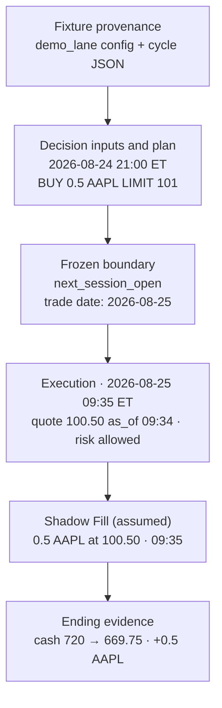

# Anatomy of one Decision Cycle

`docs/ARCHITECTURE.md` describes the system in general. This document follows one concrete cycle
from evening decision to next-trading-day evidence, using the offline demo so every value below is
reproducible on your machine.



This is a `next_session_open` fixture: its timestamps are modeled inputs from
[`config/examples/demo_lane.json`](../config/examples/demo_lane.json) and
[`fixtures/mvp/demo_lane_cycle.json`](../fixtures/mvp/demo_lane_cycle.json), not wall-clock waits.
The command makes no model, API, or broker call. It deterministically processes an already supplied
fixture Decision; rerunning it does not reproduce an LLM judgment.

```bash
uv run --no-cache python -m ripple.mvp run-shadow-cycle \
  --config config/examples/demo_lane.json \
  --fixture fixtures/mvp/demo_lane_cycle.json \
  --output /tmp/ripple-demo/demo_lane
```

For this `next_session_open` fixture, everything lands in one directory named for the **trade date**
— the next `America/New_York` regular session the orders are meant to reach, resolved through the
checked-in trading calendar rather than by weekday arithmetic, and not the evening the decision was
made:

```text
/tmp/ripple-demo/demo_lane/trading_days/2026-08-25/
├── decision_snapshot.json   fixture Decision inputs
├── order_plan.json          frozen fixture Decision intent
├── execution.json           deterministic Execution evidence
└── report.md                readable Execution summary
```

Keeping both halves of a cycle in one directory makes this fixture's prior-evening →
next-session-open boundary inspectable: you can never accidentally review a decision next to
another day's fills.

## 1. `decision_snapshot.json` — what the decision was allowed to know

```json
{
  "snapshot_id": "10de633f-be1f-4548-944a-76b94296ed5b",
  "as_of": "2026-08-24T20:55:00-04:00",
  "universe": ["AAPL", "MSFT", "NVDA", "…"],
  "inputs": { "market": { "AAPL": { "close": "100.00" } } }
}
```

The snapshot freezes the inputs, not the reasoning. `as_of` is when the facts were true; `universe`
is the lane's configured symbol set, so a later reader can tell that a symbol was *not considered*
rather than *considered and rejected*. In a real cycle `inputs` also carries compiled deterministic
facts, source URLs, warnings, and candidate-rejection evidence — often thousands of lines.

Money is always a **base-10 decimal string**, never a float. `"100.00"` survives a round trip; a
float does not.

This file is immutable. Publishing twice for the same lane and date fails rather than overwriting
it, so evidence cannot be quietly revised after an outcome is known.

## 2. `order_plan.json` — what the decision intends

```json
{
  "order_plan_id": "930b0bf7-b725-58c5-bc5e-61f4bb21c62c",
  "decision_snapshot_id": "10de633f-be1f-4548-944a-76b94296ed5b",
  "account_id": "demo_lane",
  "strategy_id": "growth_momentum_v1",
  "decision_run_kind": "fixture",
  "decision_time": "2026-08-24T21:00:00-04:00",
  "decision_rationale": "AAPL is the selected eligible strategy candidate; target a 10% position …",
  "account_baseline": { "cash": "720", "positions": {} },
  "target_portfolio": { "AAPL": "0.10", "cash": "0.90" },
  "orders": [ … ]
}
```

Four fields carry the audit trail:

| Field | Why it is frozen here |
|---|---|
| `account_id` | The lane that owns this plan. Execution refuses a plan whose account differs from its own. |
| `strategy_id` | Which Strategy Spec produced it. A later comparison does not have to trust today's config. |
| `decision_snapshot_id` | The exact inputs behind it. |
| `decision_run_kind` | `scheduled`, `manual`, `backfill`, or `fixture`. A backfilled plan can never be mistaken for a contemporaneous signal. |

`decision_rationale` is investment judgment in plain language — the *why* behind the final
portfolio, including a no-trade result. It is deliberately distinct from data-quality warnings
(which live in the snapshot) and from deterministic reason codes (which appear at execution).

`account_baseline` is the account the Decision believed it was acting on. Execution requires the
current positions to match it exactly and aborts if current cash is below it. Higher current cash is
recorded but cannot enlarge a BUY, because reservation remains capped at the frozen cash baseline.

Each order is fully specified before the market opens:

```json
{
  "order_id": "b2993899-18f8-5e39-9a5f-faf717e16738",
  "symbol": "AAPL", "side": "BUY", "quantity": "0.5",
  "order_type": "LIMIT", "limit_price": "101.00",
  "reference_price_at_decision": "100.00",
  "price_tolerance_pct": "0.01",
  "market_hours": "regular_hours", "time_in_force": "gfd",
  "buy_reason": "AAPL is the selected eligible strategy candidate."
}
```

`limit_price` is anchored to `reference_price_at_decision` — the prior session's completed close.
At Execution, `price_tolerance_pct` rejects an adverse upward BUY move beyond the frozen percentage
from that reference; it does not reject a lower BUY quote. SELL checks use the absolute move from
the reference. The planned limit still separately determines whether a Shadow Fill is marketable.

The fixture's `target_portfolio` is illustrative, and its carried `$800` equity is a synthetic
Execution-context input. Neither is a reconciled valuation of the resulting cash and position.

## 3. The modeled overnight boundary

In a real `next_session_open` cycle, the plan is not revisited, re-scored, or refreshed. Git carries
the two files into a completely fresh session, and Execution receives no new investment thesis. This
offline command processes the represented stages consecutively; it does not wait overnight. The
separation is the point: the thing that decided *what to want* is gone by the time anything can trade.

## 4. `execution.json` — what deterministic code allowed, and what it assumed

In this fixture, Execution's `as_of` is `2026-08-25T09:35:00-04:00`; it loads the plan, current
account state, loss-sale history, and the AAPL quote of `100.50` as of
`2026-08-25T09:34:00-04:00`, then runs the shared risk module. The file has three layers.

**The verdict**, per action:

```json
{
  "order_id": "b2993899-…", "symbol": "AAPL", "side": "BUY",
  "allowed": true, "reason_code": "allowed",
  "original_sizing": { "field": "quantity", "value": "0.5" },
  "actual_sizing":   { "field": "quantity", "value": "0.5" },
  "broker_order": { "type": "limit", "side": "buy", "quantity": "0.5", "limit_price": "101.00", … }
}
```

`original_sizing` and `actual_sizing` are separate on purpose. When a position cap or cash
reservation shrinks an order, both numbers survive, so a later reader sees that risk *clipped* the
order rather than that the strategy asked for less. In this shadow run, `broker_order` records the
deterministic action used for simulation and is never sent. A live fractional final quantity instead
becomes a regular-hours market order after its own marketability check, so a shadow `broker_order`
does not claim identical live fractional-order arguments.

**The fill attempt**, in this shadow run:

```json
{
  "order_id": "b2993899-…", "symbol": "AAPL", "side": "BUY", "quantity": "0.5",
  "status": "filled", "price": "100.50",
  "filled_at": "2026-08-25T09:35:00-04:00",
  "reason_code": "assumed_t_plus_one_quote_fill"
}
```

The trade-date quote of `100.50` is at or below the `101.00` limit, so the order is marketable and is
assumed filled **at the quote**, with zero fees and zero slippage. The recorded `filled_at` is the
fixture Execution `as_of`, `2026-08-25T09:35:00-04:00`; it is not the quote's 09:34 timestamp or a
claim about when this local command wrote its file. An action that passes risk but is not marketable
is recorded as `not_filled` with `reason_code: limit_not_marketable`. Shadow mode skips the broker
call — it does not skip the check.

**The ending account**, which becomes the next cycle's starting point:

```json
{
  "cash": "669.75",
  "positions": { "AAPL": { "quantity": "0.5", "average_cost": "100.5" } },
  "new_positions_today": 1,
  "loss_sales": [],
  "equity": "800", "daily_pnl": "0", "high_water_mark": "800"
}
```

`720 − 0.5 × 100.50 = 669.75`. The fill derives `cash`, `positions`, `average_cost`,
`new_positions_today`, and `loss_sales`. It **carries through** `equity`, `daily_pnl`, and
`high_water_mark` unchanged — those are re-marked from current quotes before the next Decision, not
guessed at fill time. That is why equity can look stale in this Execution evidence.

## 5. `report.md` — the same cycle for a human

```text
# Ripple — SHADOW EXECUTION
- Account: `demo_lane`     - Strategy: `growth_momentum_v1`
- Decision run: `fixture`  - Execution run: `fixture`
- Result: **allowed**

## Shadow fill attempts
- FILLED BUY AAPL 0.5 at `$100.50` (`assumed_t_plus_one_quote_fill`)

No broker write tool was called.
```

Decision run kind and Execution run kind are recorded independently, because a manual Decision may
legitimately hand off to a scheduled Execution or the reverse. The closing line is a claim about
this specific run, not a general reassurance.

## What deterministic code guaranteed in this cycle

Not the investment idea — the guardrails around it. Before that fill was allowed, checked-in Python
verified that the plan's account matched the executing lane, that the co-located snapshot and plan
existed and matched the execution input, that every symbol was inside the configured universe, that
quotes were fresh, that the baseline rules held, that the limit stayed within its applicable price
tolerance, that the position stayed under the per-symbol cap, that cash covered the cumulative
BUYs, that the new-position count and drawdown breakers were clear, and that no wash-sale rule was
violated. Position, cash, and owned-quantity constraints can clip an otherwise allowed action to a
safe quantity; missing or stale facts and failed safety checks authorize no planned order or Shadow
Fill.

## What this cycle does not prove

A Shadow Fill is an assumption that a real limit order would have filled at that quote with zero
cost. It is comparison evidence between lanes, not a claim about broker behavior. Zero fees and
zero slippage are stated MVP simplifications, not a model. And a single cycle says nothing about a
strategy — see [`INVARIANTS.md`](INVARIANTS.md) for the full safety contract and
[`TODO.md`](TODO.md) for what still has to accumulate before any comparison is meaningful.
