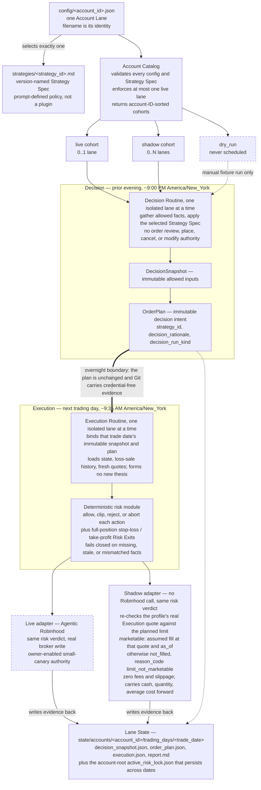

# Current architecture

This document describes Ripple as implemented today. Durable reasons belong in `docs/DECISIONS.md`; unfinished work belongs in `docs/TODO.md`.

Ripple is an account-catalog MVP for comparing isolated strategy lanes. The catalog, manual dry-run path, shadow execution path, hosted schedules and acceptance, and reviewed live Robinhood broker-write loop are implemented. Current lane membership and bindings are read from `config/*.json`, not restated in architecture documentation.

## System at a glance



The LLM supplies bounded fact gathering and investment judgment. Python validates configurations and artifacts, compiles any strategy-required deterministic facts, assigns stable IDs, quantizes new planned limits to broker-valid price increments, performs deterministic risk calculations, and simulates Shadow Fills. The owner supplies broker binding, funding, live activation, restart, and strategy-switch decisions.

## Account Catalog interface

Every file matching `config/*.json` is one Account Lane. The filename stem is its canonical identifier and must be lowercase `snake_case`; there is no duplicated `account_id` field and no central `accounts[]` document.

```json
{
  "description": "Human-readable purpose, strategy, universe, and risk summary.",
  "strategy": "<strategy_id>",
  "execution": {
    "mode": "<live|shadow|dry_run>",
    "cycle_profile": "<next_session_open|same_session_close>"
  },
  "shadow": {"initial_cash": "<decimal_string>"},
  "universe": ["<SYMBOL>"],
  "risk": {}
}
```

`execution.cycle_profile` is optional and defaults to legacy `next_session_open`; `shadow.initial_cash` is required only for a shadow lane. Financial values remain base-10 decimal strings.

The catalog validates, as one operation:

- strict configuration fields and risk value shapes;
- canonical account and strategy identifiers;
- a real `strategies/<strategy_id>.md` file for every selected strategy;
- unique universe symbols;
- `execution.mode` in `live`, `shadow`, or `dry_run`; and
- `execution.cycle_profile` in `next_session_open` or `same_session_close` when present; and
- no more than one live configuration.

The catalog returns deterministic, account-ID-sorted cohorts. A missing strategy or second live configuration invalidates the catalog instead of silently skipping a lane.

## Strategy seam

`strategies/` may contain multiple version-named Strategy Specs. A configuration selects exactly one by identifier. The Decision Routine reads that file completely and applies it to only its assigned lane.

The seam is deliberately small: Strategy Specs are prompt-defined Markdown policies, not Python plugins. The generic publisher and deterministic risk module remain authoritative for shape, sizing, and safety. Adding a new strategy does not require changing Python, but selecting a missing strategy fails catalog validation.

A Strategy Spec may require checked-in deterministic preprocessing before ranking or research. Such a compiler reads the selected lane configuration, requires its symbol set to match the configured universe exactly, and emits credential-free facts and provenance for `DecisionSnapshot.inputs`; incomplete compilation stops publication. Qualitative research, candidate rejection, warnings, and thesis metadata remain Strategy Spec responsibilities, while every strategy publishes through the shared `OrderPlan` schema. Raw authenticated responses are never persisted.

Every new `OrderPlan`, Decision record, deterministic result, execution record, and report carries `strategy_id`. New OrderPlans also carry a concise `decision_rationale` explaining the final target portfolio and orders, and freeze whether Decision was `fixture`, `manual`, `scheduled`, or `backfill`; execution evidence independently freezes its own run kind. Historical plans without rationale or Decision run provenance remain readable as legacy evidence. A versioned Strategy Spec should not be edited in place after it has produced decisions; create a new identifier so historical attribution stays meaningful. Git history retains its exact checked-in content.

## Execution modes, cycle profiles, and scheduled cohorts

A Cycle Profile freezes the timing topology and Execution-session `trade_date` of each new OrderPlan. `next_session_open` preserves the prior-evening Decision and next-Trading-Day morning Execution. A designated-owner manual Decision made before 9:30 AM may explicitly freeze that same regular Trading Day with `--trade-date`; this is not available to scheduled or historical-backfill runs. `same_session_close` uses a 2:25–3:05 PM Decision and later 3:15–3:40 PM Execution on one regular New York Trading Day. V1 excludes early-close sessions and historical backfill for the same-session profile; a manual run bypasses only the clock window, not the frozen date, calendar, ordering, risk, or mode checks.

| Mode | Scheduled selection | Execution behavior | Authority |
|---|---|---|---|
| `live` | The live cohort contains zero or one lane | Deterministic risk output may be sent to the reviewed Agentic Robinhood adapter after the Live Gate | Human-owned activation; real broker consequence |
| `shadow` | Every matching shadow lane is selected in account-ID order | Deterministic risk runs; marketable allowed orders receive profile-attributed Execution-quote fills and virtual ending state | No broker connection or write |
| `dry_run` | Excluded from all scheduled cohorts | Manual fixture/development evaluation only; proposed broker arguments but no fill | Developer evidence only |

Changing an execution mode is a reviewed human operation. A shadow-to-live change also requires broker binding and real cash/position baseline reconciliation; virtual holdings never authorize a real trade.

## Current scheduled runs

Ripple uses six non-overlapping triggers. The four existing live/shadow triggers select `next_session_open`; two close-shadow triggers select only `same_session_close`.

| Run | Selection | Intended time |
|---|---|---|
| Live Decision | 0..1 live lane | Sunday–Thursday around 9:00 PM `America/New_York` |
| Shadow Decision | `next_session_open` shadow lanes | Sunday–Thursday around 9:00 PM `America/New_York` |
| Live Execution | 0..1 live lane | next trading day around 9:35 AM `America/New_York` |
| Shadow Execution | `next_session_open` shadow lanes | next trading day around 9:35 AM `America/New_York` |
| Close Shadow Decision | `same_session_close` shadow lanes | Trading Day around 2:30 PM `America/New_York` |
| Close Shadow Execution | `same_session_close` shadow lanes | same Trading Day around 3:20 PM `America/New_York` |

A scheduled trigger outside its profile's valid session or window is a successful no-op and writes no artifact. This includes weekends and full closures for both profiles and every early-close session for `same_session_close`. There may be zero live lane; the live runs then finish without account work. Dry-run lanes are never selected. Schedules never automatically backfill missed cycles. A designated-owner historical backfill remains available only to `next_session_open` live/shadow cycles with complete point-in-time inputs and the normal safeguards.

Each shadow trigger owns one mode-and-profile cohort, but every lane remains an independent Decision Cycle. One lane's malformed input or failure is reported for that lane and does not authorize, mutate, or suppress another lane's work.

## One Decision Cycle

### Decision

The Decision Routine:

1. validates the complete catalog and selects its live or shadow cohort;
2. isolates one lane's configuration, state root, and selected Strategy Spec;
3. gathers allowed market and account facts;
4. prepares one strict `DecisionSnapshot`, account baseline, Decision Rationale, target portfolio, and zero or more proposed orders; and
5. publishes one immutable, strategy-attributed `OrderPlan`.

Decision never reviews, places, cancels, or changes a broker order. Missing facts produce no trade or stop that lane rather than authorizing a guess. A second publication for the same lane and date fails instead of overwriting evidence.

For a shadow lane, the Decision baseline comes from its latest prior `ending_account`; the first cycle starts from the reviewed `shadow.initial_cash`. Before the next cycle, current quotes mark equity and daily P&L, high-water mark moves only upward, and the prior trading day's new-position count resets. A live lane reads its real account through the platform-managed connection. These sources never merge.

### Plan boundary

The published plan remains unchanged. Git carries credential-free artifacts into the next fresh routine, whether the boundary is overnight or within the same session. Execution receives no new investment thesis and does not rewrite Decision content.

### Execution

Execution loads the plan from the current trade-date directory, current account state, loss-sale history, and fresh quotes. Before risk evaluation, it requires that directory's immutable `decision_snapshot.json` and `order_plan.json` to exist and match the execution input. This binding applies equally to scheduled and explicitly authorized manual runs. Positions must match the immutable account baseline exactly. Current cash below the frozen baseline aborts; a higher balance is recorded and allowed, while BUY cash reservation remains capped at the frozen baseline so incidental cash cannot increase capital. It then runs the shared deterministic risk module.

Live execution submits only script-allowed actions exactly as emitted through the reviewed Robinhood read/place/cancel loop. The designated owner's standing approval authorizes Scheduled Live Execution to place each emitted action once without Robinhood review or per-order confirmation; an explicit `--manual-run` supplies the equivalent authority for that manual cycle. Because Robinhood supports fractional shares only as regular-hours market orders, deterministic risk converts a Live action whose final quantity is fractional from the immutable planned LIMIT intent to `MARKET + regular_hours` only after the current quote satisfies that planned limit. Integer-share Live actions remain LIMIT orders. The plan's limit remains the BUY sizing basis, but the market fill has no hard price cap and may slip beyond it. A selected `live` configuration records owner activation for its reviewed small-canary allocation; routines cannot enable a lane, change strategy or capital, clear a tier-two lock, or retry an ambiguous broker outcome.

Shadow execution uses the same risk output but never calls Robinhood. For each allowed action:

- the current quote must still satisfy the planned limit (`BUY quote <= limit`, `SELL quote >= limit`); market Risk Exits are marketable;
- a marketable order is assumed filled at the execution quote and `as_of` time;
- fees and slippage are explicitly zero in this MVP;
- an unmarketable limit is recorded as `not_filled`; and
- cash, quantity, average cost, new-position count, and visible loss-sale state are carried into an immutable per-cycle `ending_account`.

The plan freezes its Cycle Profile and Trading Day. Every fill attempt occurs after Decision at the actual profile-specific Execution quote; Shadow never backdates a fill to the Decision reference price or uses a future official close.

## Modules and responsibilities

| Module | Interface responsibility | What stays behind it |
|---|---|---|
| Account catalog | Load all lane configs and select a mode or mode-plus-profile cohort | Filename identity, strict schema, strategy existence, live-count validation, deterministic ordering |
| Trading calendar | Answer whether a New York regular session exists and which session follows a date | Checked-in NYSE closures, coverage bounds, and a fail-closed refusal to extrapolate |
| Strategy facts compiler | Compile one normalized source-attributed document when required by a Strategy Spec | Decimal formulas, session alignment, provenance, interpolation rejection, and fail-closed validation |
| Decision publisher | Publish one validated Decision Cycle | Timing, universe, target weights, stable IDs, strategy attribution, immutable writes |
| `DecisionSnapshot` | Represent allowed decision inputs | Strict JSON and immutable nested values |
| `OrderPlan` | Represent strategy-attributed decision intent | Decision rationale, strict order shape, account baseline, portfolio weights, immutable nested values |
| Risk module | Return allowed, clipped, rejected, or aborted actions | Account binding, freshness, sizing, cash reservation, loss/drawdown/wash-sale/exit rules |
| Shadow adapter | Return fill attempts and ending virtual state | Profile-attributed marketability, Execution-quote fills, position/cash state transition, no broker I/O |
| Live adapter | Use deterministic output with Robinhood | Account binding, duplicate/history checks, exact one-call placement, ambiguity stop, credential-free evidence |
| Lane State | Carry credential-free evidence across fresh sessions | Per-lane trade-date cycles and an optional active risk lock |

## Artifacts and state

| Artifact | Mutability and use |
|---|---|
| `DecisionSnapshot` | Immutable allowed facts and universe for review/reproduction |
| `OrderPlan` | Immutable account-, strategy-, cycle-, and Decision-run-attributed decision |
| Dry-run result | Proposed actions plus Execution run provenance; explicitly not fills |
| Shadow result | Risk result, fill attempts, assumptions, ending virtual account state, and Execution run provenance |
| Report | Human-readable action and Shadow Fill summary |
| Tier-two lock | Lane-scoped persistent block on new BUYs until owner review |

Canonical state roots are `state/accounts/<account_id>`. Each cycle lives at `trading_days/<trade_date>`, where `trade_date` is the next New York trading day after the Decision. `decision_snapshot.json` and `order_plan.json` are published prior evening; `execution.json` and `report.md` join the same directory after Execution. The optional account-root `active_risk_lock.json` persists across dates. Cycle artifacts never cross roots or overwrite earlier evidence.

## Deterministic safety

All modes use the same rules: 20% maximum symbol position, three new positions per day, 5% daily-loss breaker, 10% tier-one drawdown, 15% tier-two drawdown and owner restart, 15-minute quote freshness, 30-day taxpayer-wide wash-sale lookback, 8% stop loss, and 20% take profit.

Execution also checks the decision baseline, universe, price tolerance, cumulative BUY cash, and SELL holdings. Position changes and cash decreases relative to the baseline abort; cash increases do not, but they never enlarge the frozen BUY budget. Every planned limit must remain within its positive per-order tolerance, which may not exceed 10%. At Execution, a BUY's price tolerance rejects only an adverse upward move beyond that frozen percentage; a lower current price remains eligible for the separate limit-marketability, opening-gap, account, and risk checks. SELL price tolerance remains symmetric. Before a fractional Live action is converted to market, its quote must be marketable against the planned limit (`BUY quote <= limit`, `SELL quote >= limit`); otherwise it is rejected with `limit_not_marketable`. A BUY may additionally freeze `gap_cancel_above`; such an order requires the actual regular-session open and is rejected when that open is strictly above the frozen threshold. A missing required session open aborts the plan. Missing or stale facts, malformed input, cross-account mismatch, or unsafe sizing fails closed. A deterministic full-position Risk Exit is the only action allowed without a matching planned order.

Before publishing a new OrderPlan, the Decision publisher converts limits above $1 to broker-valid whole-cent prices without weakening their protective direction: BUY limits round down and SELL limits round up. This happens before immutable publication and deterministic risk evaluation. Execution never rounds, repairs, or otherwise changes a published limit, and historical plans retain their recorded values.

## Authority and reliability

Deterministic code controls schemas, strategy-required numeric fact derivation, IDs, account binding, timing, risk calculations, and Shadow Fill state transitions. Routine prompts control source gathering, normalization, qualitative research, and LLM tool use. The owner and platform control credentials, schedules, broker binding, live activation, capital, and restart.

Git is continuity and audit evidence, not a transactional submission journal or cross-runner lease. Live execution still accepts duplicate-call, ambiguous-timeout, crash-before-log, prompt/tool-use, and model-drift risk at the small canary allocation. Shadow results avoid broker risk but remain assumptions, not evidence that a real limit order would have filled at that price or with zero costs.

Credentials, tokens, cookies, account numbers, and raw authenticated responses never enter Git artifacts, fixtures, prompts, logs, or reports.

## Current non-goals

The implemented architecture does not include automatic strategy scoring/promotion, a dashboard, multiple simultaneous live lanes, a Python strategy engine, transactional persistence, exactly-once broker execution, automatic reconciliation, same-day entry and exit, additional brokers, tax-lot optimization, a calibrated slippage/fee model, or historical backtesting and the market-data replay layer it would require. Forward shadow lanes are the simulation path; see `docs/DECISIONS.md`.

Operational procedures belong in `docs/RUNBOOK.md`. Remaining hosted and live work belongs in `docs/TODO.md`.
