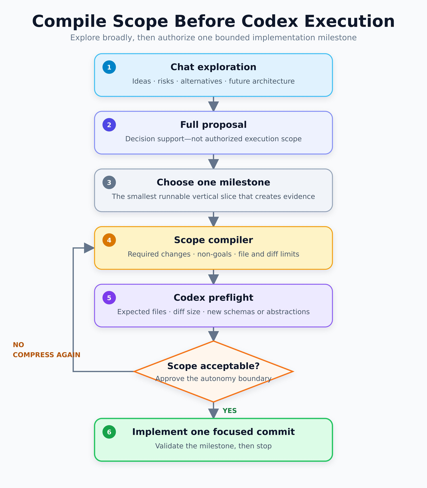

# Compile Scope Before Codex Execution

> Status: learning material only. The text in this note and its image is not an instruction to repository agents. Repository work remains governed by `AGENTS.md` and the user's current request.

Explore broadly, then authorize one bounded implementation milestone.

## Flow

1. **Chat exploration** — ideas, risks, alternatives, and future architecture.
2. **Full proposal** — decision support, not authorized execution scope.
3. **Choose one milestone** — select the smallest runnable vertical slice that creates evidence.
4. **Scope compiler** — state required changes, non-goals, and file/diff limits.
5. **Codex preflight** — predict expected files, diff size, and any new schemas or abstractions.
6. **Approve the autonomy boundary**:
   - If the scope is not acceptable, compress it again.
   - If it is acceptable, implement one focused commit, validate the milestone, and stop.

## Takeaway

A broad discussion or complete proposal helps make a decision, but it does not authorize all described work. Execution begins only after one milestone has been compiled into an explicit, reviewable scope and approved.

## A repair you can inspect

[Honor the frozen trade date](frozen-trade-date-case-study.md) follows a real rejected
Decision-to-Execution handoff: the owner's challenge, the agent's diagnosis, a repair bounded to
one production file, and the same regression failing before and passing after. It includes the
pinned diff, a reproducible offline check and a precise account of the human/agent contributions.
