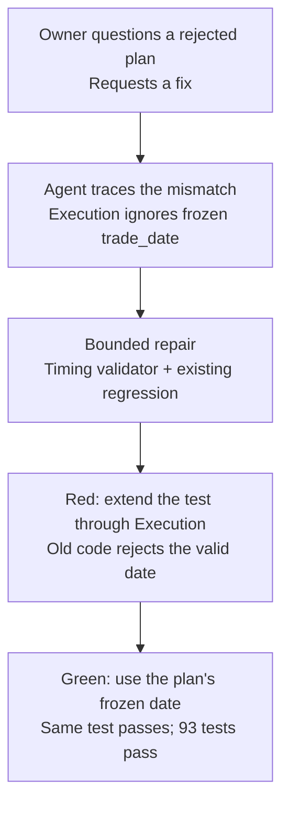

# A real AI-assisted repair: honor the frozen trade date

An authorized pre-open Decision could publish a plan for the same trading day, but scheduled
Execution rejected it. The owner challenged that result and asked for a fix. The agent traced the
mismatch, extended an existing regression test and repaired one production file while preserving
the timing safeguards.

**Result:** the same regression fails on the parent revision and passes with
[fix `68fccb2`](https://github.com/Alicia1529/ripple-trading/commit/68fccb2f843f4ebee07cd8b4f9afe353f9cc5da0).
The fixed revision passes all 93 tests. The repair did not replay the missed trading cycle.

This case puts [Compile Scope Before Codex Execution](compile-scope-before-codex-execution.md)
into a concrete setting. It is retrospective learning material, not operational instructions.
The scope below summarizes the recorded work; it is not a verbatim prompt issued before the fix.



## 1. The symptom: a valid handoff was rejected

Ripple normally decides in the evening and executes the next trading day. An existing,
owner-authorized exception lets a manual Decision made before 09:30 New York time explicitly
freeze that same regular trading day. Scheduled Execution must still obey its own timing checks.
That contract was already recorded in the
[decision at the fix revision](https://github.com/Alicia1529/ripple-trading/blob/68fccb2f843f4ebee07cd8b4f9afe353f9cc5da0/docs/DECISIONS.md#L42).

On September 4, 2026, Shadow Execution reported that an early-morning manual plan had to wait
until the next trading day. The owner questioned why it had stopped and explicitly requested a
fix. The scheduled routine had stopped at the timing gate; it had not silently changed the plan
or switched to manual Execution to get past the rejection.

The regression uses **modeled August 27 timestamps**, separate from the September 4 incident:

| Event | Fixture value | Required behavior |
|---|---|---|
| Manual Decision | August 27, 01:16 New York | Publish an explicitly authorized same-day plan |
| Frozen `trade_date` | `2026-08-27` | Carry that date into Execution |
| Scheduled Execution | August 27, 09:35 New York | Validate against August 27 |
| Old date calculation | August 28 | Incorrectly reject the August 27 Execution |

## 2. The wrong assumption: derive a date that was already decided

The publisher accepted and froze the override, but the Execution timing validator independently
recomputed the next trading day from `decision_time`:

```python
if execution_at.date() != next_trading_day(decision_at.date()):
    raise ValueError("execution must occur on the next trading day after the decision")
```

That assumption fit the usual overnight path. It broke the authorized pre-open path because
the two stages disagreed about which date was authoritative. The agent's diagnosis was to use
the validated, immutable plan's `trade_date` at the handoff.

## 3. The scope: restore the contract and keep the safeguards

| Boundary | What the repair did |
|---|---|
| Production change | Updated the validator and its dry-run/shadow callers in `ripple/mvp.py` |
| Regression | Extended one existing test in `tests/test_mvp_cycle.py` through scheduled Execution |
| Date authority | Passed `trade_date=_plan_trade_date(plan)` into the validator |
| Preserved checks | Expected date is a trading day; Execution is on that date and after Decision; scheduled window remains 09:30–09:50 New York |
| Preserved branches | Manual Execution and `same_session_close` timing branches were unchanged |
| Operational boundary | No config, strategy, risk-rule or historical cycle-artifact changes in the fix commit |

The affected rule is **invariant 5: Decision and fill times stay honest**. Keeping the trading-day,
ordering and window checks matters: accepting the intended date must not create unrestricted
same-day execution authority. See the
[full production diff](https://github.com/Alicia1529/ripple-trading/commit/68fccb2f843f4ebee07cd8b4f9afe353f9cc5da0)
and [invariants](../docs/INVARIANTS.md).

The repaired date selection reads:

```python
expected_date = (
    date.fromisoformat(trade_date)
    if trade_date is not None else next_trading_day(decision_at.date())
)
```

The validator then checks the trading calendar, matching execution date, chronological order and
normal window. Its optional-date fallback retains next-trading-day behavior. The change used the
existing plan model; it did not introduce a new date flag or widen the execution window.
[Read the complete validator](https://github.com/Alicia1529/ripple-trading/blob/68fccb2f843f4ebee07cd8b4f9afe353f9cc5da0/ripple/mvp.py#L137).

## 4. The evidence: test the next stage, not just publication

Before the repair, the existing test asserted that the plan froze `2026-08-27` and that its
artifact existed. Both assertions could pass while the downstream executor remained broken.

The agent extended that test to invoke `execute_dry_run` with the published plan and modeled
09:35 execution context, **without manual Execution**, and assert:

```python
self.assertEqual(result["execution_run_kind"], "scheduled")
```

The test uses a temporary dry-run configuration and temporary artifacts. It crosses the actual
publication-to-execution interface without making a broker call. Inspect the
[complete regression](https://github.com/Alicia1529/ripple-trading/blob/68fccb2f843f4ebee07cd8b4f9afe353f9cc5da0/tests/test_mvp_cycle.py#L57).

On September 7, 2026, this case study independently reproduced the following results from the
pinned Git revisions. The **same fixed-revision test file** was used for both regression runs:

| Code under test | Observation |
|---|---|
| Parent `f1e71b5` + extended regression | Exit 1: `ValueError: execution must occur on the next trading day after the decision` |
| Fix `68fccb2` + same regression | Exit 0: one test passes |
| Fix `68fccb2`, full suite | Exit 0: all 93 tests pass |

The test count stayed at 93 because an existing test was extended. The additional evidence is the
handoff coverage. The regression directly proves the dry-run path; inspection confirms that the
shadow caller passes the same frozen date to the shared validator. This test is not a hosted
broker acceptance run or an exhaustive test of every timing input.

<details>
<summary>Reproduce the red/green result without changing your checkout</summary>

Run from the repository root with Python 3.12 or later through `uv`. The script extracts only
code, tests and their supporting fixtures/configurations into temporary directories, then removes
those directories on exit. It uses local Git history and requires both pinned revisions to exist.
It does not check out another branch, access broker credentials or replay trading state.

```bash
uv run --no-cache python - <<'PY'
from pathlib import Path
import io
import subprocess
import sys
import tarfile
import tempfile

fix = '68fccb2f843f4ebee07cd8b4f9afe353f9cc5da0'
test = ('tests.test_mvp_cycle.MvpDryCycleTests.'
        'test_manual_decision_can_freeze_an_explicit_same_day_trade_date')
regression = subprocess.check_output(['git', 'show', f'{fix}:tests/test_mvp_cycle.py'])
paths = ['.python-version', 'pyproject.toml', 'uv.lock', 'ripple', 'tests', 'config', 'strategies', 'fixtures']
with tempfile.TemporaryDirectory(prefix='ripple-trade-date-case-') as temporary:
    for label, revision, expected in [('before', fix + '^', 1), ('after', fix, 0)]:
        root = Path(temporary) / label
        root.mkdir()
        archive = subprocess.check_output(['git', 'archive', revision, *paths])
        with tarfile.open(fileobj=io.BytesIO(archive)) as source:
            source.extractall(root, filter='data')
        (root / 'tests/test_mvp_cycle.py').write_bytes(regression)
        result = subprocess.run([sys.executable, '-m', 'unittest', '-v', test], cwd=root, capture_output=True, text=True)
        print(f'--- {label}: regression exit {result.returncode} ---', flush=True)
        print(result.stdout + result.stderr, flush=True)
        assert result.returncode == expected
        if label == 'before':
            assert 'execution must occur on the next trading day after the decision' in result.stderr
        else:
            suite = subprocess.run([sys.executable, '-m', 'unittest', 'discover', '-s', 'tests', '-t', '.'], cwd=root, capture_output=True, text=True)
            print('--- fixed-commit full suite ---', flush=True)
            print(suite.stdout + suite.stderr, flush=True)
            assert suite.returncode == 0
PY
```

</details>

## 5. The outcome and the human/agent contribution

The fix commit contains **one production file, one test file and one handoff record**. Its
[contemporaneous handoff](https://github.com/Alicia1529/ripple-trading/blob/68fccb2f843f4ebee07cd8b4f9afe353f9cc5da0/docs/AGENT_HANDOFF.md#L19)
records red/green verification and 93 passing tests. It also records that the old quote had
expired: the missed cycle was not replayed, and the repair generated no trading artifact or
broker action. Passing a software regression did not make stale market information valid again.

The collaboration summary comes from the September 4 owner request and agent updates in the
**Ripple Shadow Execution** task, reviewed when writing this case. The private task transcript
is not published here; the linked Git diff, test and handoff independently support the technical
claims and can be inspected by repository readers.

| Contribution | What the record supports |
|---|---|
| Owner | Questioned the rejected handoff and explicitly requested a fix within the project's existing scope and safety rules |
| Agent | Diagnosed the conflicting date calculation, bounded the change, extended the regression, implemented the repair and reported validation |
| Acceptance evidence | An inspectable diff, the same regression failing before and passing after, unchanged timing gates and a recorded operational stop |

An interview explanation from the owner's perspective:

> I challenged a scheduled run that rejected an authorized same-day plan and asked the agent to
> fix the inconsistency. The agent found that Execution recomputed a date already frozen in the
> plan. The repair stayed within one production file and extended an existing test through the
> handoff. That regression fails on the old code and passes with the fix, while the timing gates
> remain in place. We did not replay the missed cycle with an expired quote. My contribution was
> questioning the behavior and authorizing the repair within the project's constraints; the agent
> handled diagnosis and implementation, with code and tests making the result inspectable.

The reusable lesson is to define the expected handoff, constrain the repair and verify behavior
across that boundary. A passing publication test alone could not establish that Execution would
accept what Decision had legitimately produced.
